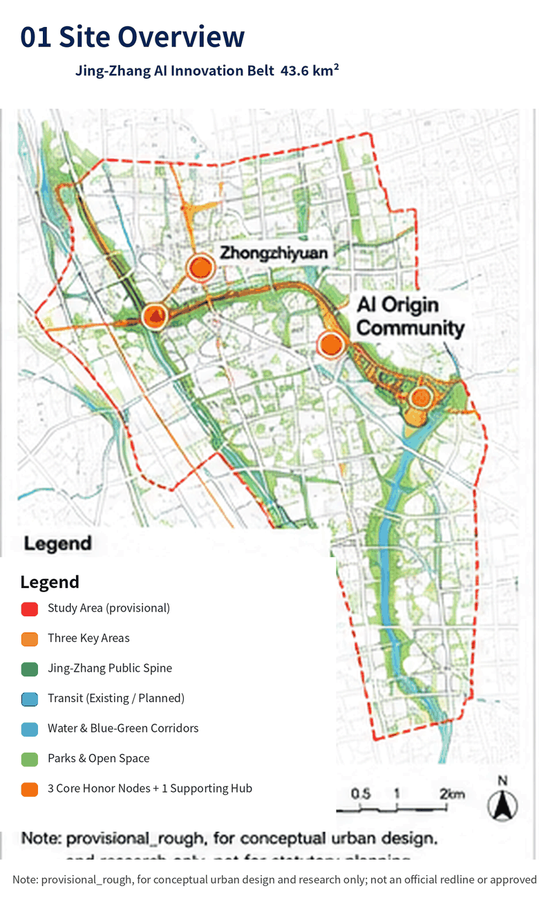
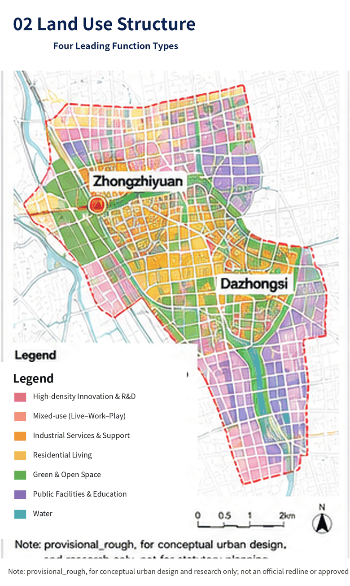
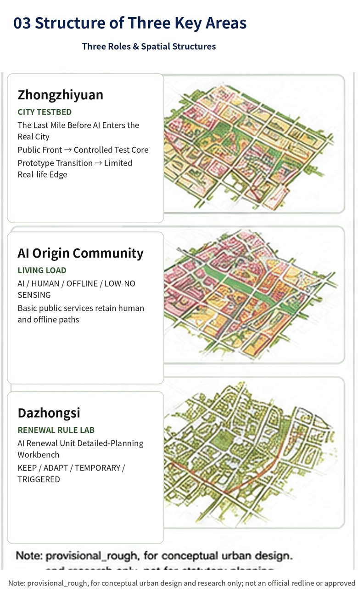
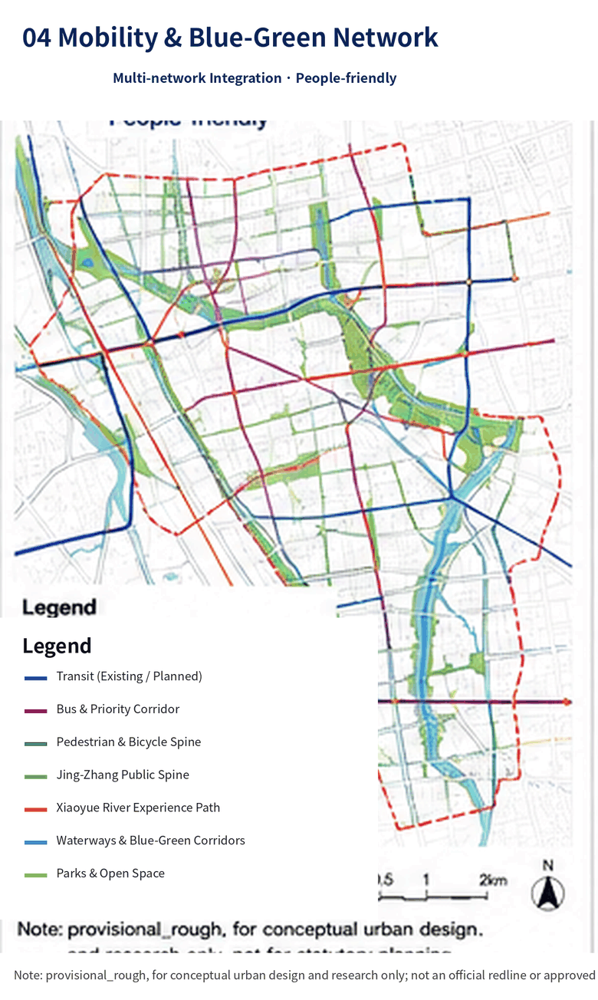
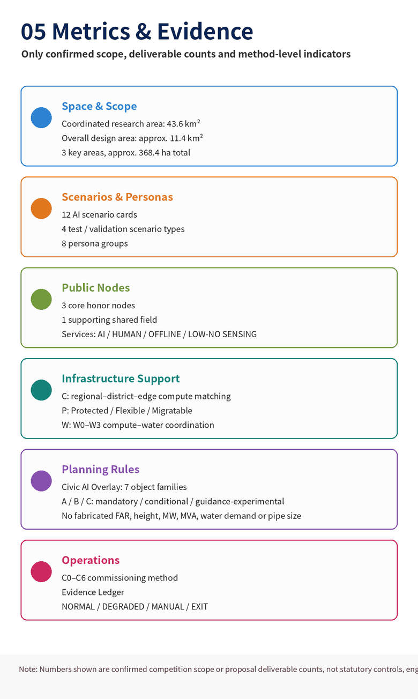

# JING-ZHANG CITY COMMISSIONING BELT
## A CIVIC AI OVERLAY FOR THE AI-NATIVE CITY
### Urban Planning and Real-World Innovation for the AI Era

**One-sentence proposal.** A century ago, Jing-Zhang railway engineering relied on surveying, standards, trial operation and verification to establish a dependable physical connection. Today AI is changing how cities produce, live and operate. This proposal does not carve out a separate “technology land” for AI. It introduces a **Civic AI Overlay** above conventional planning so that compute interfaces, operating permissions, human alternatives, data/model versions, re-test triggers and exit conditions can be expressed by planning and tested in Zhongzhiyuan, Beijing AI Origin Community and Dazhongsi.

All spatial moves are conceptual open-call proposals. The package uses the repository-maintained `provisional_rough` geometry, not an official redline. Exact official polygons, statutory controls, ownership, heritage controls and engineering data must trigger recalculation and professional confirmation. [source:BOUNDARY-SOURCE] [standard:PROJECT-OFFICIAL-ANNOUNCEMENT]

### No Standard Answer for a City: Human and Silicon Intelligence for Better Life

There is no single standard answer for a life, and even less for a city. The meaning of a city is not to be “solved” once by a planner, an institution, or an algorithm, but to enable the people who live there to keep sensing, choosing, creating, and revising. Cities have historically embodied and amplified human experience, institutions, and engineering intelligence. In the future, AI systems will increasingly contribute sensing, computation, reasoning, and coordination. We do not frame these two forms of intelligence as competitors, nor do we cast AI as a “super-brain” that replaces residents' value judgments. **Human intelligence and silicon intelligence share a common aspiration: to make our lives better.** Human intelligence contributes values, lived experience, ethics, emotion, responsibility, and final judgment; silicon intelligence contributes large-scale sensing, complex simulation, real-time coordination, and continuous learning. Their common purpose is not technology itself, but better everyday life, public value, and long-term urban resilience.

**The Civic AI Overlay is the planning layer; C0-C6 is only the operating layer.** Planning must first answer where an AI capability sits, what urban resource it can call, what permission it has, who is responsible, and how it degrades or exits. The gates then govern how that capability moves from simulation to bounded real-world use. Every AI proposal begins as a hypothesis and must pass rule and public-interest review, shadow operation, limited real load, and human-supervised operation. If evidence is insufficient, it stops; if risks cannot be controlled, it rolls back; if public value is not established, it should not proceed. **Intelligence may increase, but the boundaries of authority must remain explicit; systems may become smarter, but the city must retain human choice.** [standard:PROJECT-AGENT-OPEN-CALL-TASKBOOK] [depth:risk_missing_data]

## Design Basis and Source List

Formal task evidence comes from the organizer announcement, repository design brief, agent taskbook, source registry and provisional geometry. The methodology also distills prior work on municipal infrastructure, resilience, AIDC commissioning, AI-assisted regulatory planning, urban renewal and underground-space coordination. No internal client base map, non-public metric or restricted project material is uploaded; only general methods are transferred. [source:OFFICIAL-ANNOUNCEMENT] [source:AGENT-TASKBOOK] [source:SOURCE-REGISTRY]

Three professional principles structure the proposal. First, **AI creates new regulatory-planning objects**: edge-compute interfaces, flexible-energy interfaces, robot/logistics interfaces, sensing boundaries, operating permissions, human takeover and exit conditions cannot remain operational footnotes. Second, **AI infrastructure in a central-city district must be spatially matched rather than assuming a new large data centre**; the proposal therefore narrows its infrastructure innovation to Compute, Power and Water. Third, **public interest must become spatially testable** through AI, human, offline and low/no-sensing service paths. The hierarchy is therefore: **real urban design + Civic AI Overlay + C/P/W professional support + C0-C6 operating method**. [standard:PROJECT-AGENT-OPEN-CALL-TASKBOOK] [depth:existing_conditions_diagnosis]

## Mandatory Task Coverage Index | agent.1-agent.6

The six mandatory tasks are not buried in narrative prose. They are treated as six review entrances into one urban system. Machine-readable mappings are provided in `compliance_matrix.json`; the table below supports rapid human review.

|Mandatory task|Direct response in this proposal|Primary evidence|
|---|---|---|
|**agent.1 Belt-wide concept and functional coordination**|Explicit alignment with the three official positionings, five functions and Three Zones-Two Wings; Jing-Zhang public spine and three key areas form the urban-design body, while **Civic AI Overlay** is the first planning innovation|Official-task mapping, three-level scope, nine GeoJSON layers, five core figures|
|**agent.2 Full-stack AI innovation and world-class ecosystem**|A Research → Test → Limited Deployment → Daily Use → Evidence → Rule Update → Re-test loop; Zhongzhiyuan validates, AI Origin carries real-life load, and Dazhongsi translates evidence into renewal rules|Seven international mechanism cases; CITY TESTBED / LIVING LOAD / RENEWAL RULE LAB|
|**agent.3 AI+ scenarios and intelligent urban vitality**|Twelve formal scenario cards share one evidence-risk-permission-human-rollback substrate; four are industrial/planning validation scenarios|SC-01-SC-12; `metrics.json`|
|**agent.4 AI public space, native businesses and landmarks**|The heritage park becomes an open innovation and civic-exchange spine with **three core honor nodes plus one supporting Commissioning Commons** and embedded agent services|Public-space section, public-node system, `public_space.geojson`|
|**agent.5 Centennial Jing-Zhang culture and new AI culture**|Rather than copying railway imagery, the proposal translates the historical logic of trial operation before real service into a contemporary culture of commissioning, evidence and responsibility|Narrative, brand system, Open Evidence Hall and contribution wall|
|**agent.6 Global activity system and long-term operation**|Commissioning Week, Open Urban AI Plugfest, Civic Audit Open Day and Rulebook Release form an annual operating cycle, with the City Evidence Ledger accumulating reusable evidence|Long-term operation/phasing; City Evidence Ledger|

The six tasks are therefore different views of one system, not six disconnected AI feature lists. [source:AGENT-TASKBOOK] [depth:professional_evidence_chain]

## Three-Level Scope Framework

**43.6 km2 coordinated research area - CITY SYSTEM.** The official text scale is used to study the closed loop among AI research, industry, talent, compute/energy, public services and real-scene feedback. The announced text area is not converted into a statutory polygon.

**Approx. 11.4 km2 overall design area - CITY COMMISSIONING DISTRICT.** The Jing-Zhang Heritage Park and its surrounding urban fabric host a continuous public spine, east-west stitching nodes, AI-infrastructure interfaces, resilient municipal networks and renewal projects. The submitted provisional model recalculates to about 11.41 km2. [data:geometry/site_boundary.geojson#SITE-001] [metric:site_area_sqm]

**Three key areas - CITY LABS.** Zhongzhiyuan, Beijing AI Origin Community and Dazhongsi form three complementary laboratories: test and validation, everyday living load, and renewal-rule translation. Their provisional edges are not parcel or road redlines. [data:geometry/key_areas.geojson#PROV-KEY-001] [metric:key_area_count]

## Coordinated Research Area: Industry and Future City Research

The proposal first follows the official task structure and then adds its planning innovation. The three official positionings are interpreted as a **centennial Jing-Zhang cultural belt, an urban AI-life experience belt, and an AI convergence-innovation belt**. The five functions are mapped to full-stack innovation, a world-class AI ecosystem, AI+ scenario enablement, an intelligent and lively city, and global AI-governance influence. The Jing-Zhang public spine links the three key areas, while the Zhongguancun technology-service wing and Xiaoyue River scenario-enablement wing connect research, professional services, communities, municipal systems and real-world urban feedback. [source:AGENT-TASKBOOK] [standard:PROJECT-AGENT-OPEN-CALL-TASKBOOK]

### 1. Urban-design body: public spine + three key areas + two wings

The **Jing-Zhang Public Spine** is first an everyday public space, active-mobility route and heritage carrier, and only second a digital interface. Digital elements remain small, explainable and removable, combined with shade, seating, emergency support, wayfinding and public service rather than forming a continuous technology-display wall. [standard:MOHURD-URBAN-DESIGN-MEASURES]

The three key areas form a **technology validation → everyday living load → renewal/commercial rule translation** commissioning chain:
- **Zhongzhiyuan CITY TESTBED** validates devices, robots, interfaces and municipal AI before bounded real-world use;
- **Beijing AI Origin Community LIVING LOAD** tests whether AI improves housing, education, health, community, accessibility and mobility without excluding non-digital paths;
- **Dazhongsi RENEWAL RULE LAB** converts evidence into renewal rules, project lists and conditions for commercial/public-space operation, including high-concurrency station-area and consumption scenarios, without pre-judging a statutory TOD scheme or development intensity.

This keeps the useful “R&D-validation-translation” logic from the external advice without renaming official areas or subordinating public value to commercial conversion. [depth:overall_spatial_structure]

### 2. Civic AI Overlay: an AI-era regulatory-planning overlay

**Civic AI Overlay is the first planning innovation.** Conventional planning continues to govern land use, intensity, roads, facilities, public space and urban character. The Overlay adds AI-era objects: edge-compute interfaces, scenario compute grades, sensing/service extents, autonomous-system permissions, equivalent human access, data/model versions, shadow-operation conditions, responsible parties, re-test triggers and rollback/exit conditions.

Minimum rule schema:

`Rule ID → Spatial Scope → Object → Requirement/KPI → Source → Responsible Party → Permission → Commissioning Gate → Evidence → Version → Re-test Trigger → Rollback/Exit`

Rules are classified as A Mandatory, B Conditional and C Guidance/Experimental. The Overlay is a regulatory-planning prototype, not a new statutory “AI land-use class”, and it does not replace statutory planning, approval or real public participation. [depth:professional_evidence_chain]

### 3. AI Infrastructure Support: Compute-Power-Water Nexus

**C | Compute Matching.** Use a regional-compute / district-shared-service / edge-node hierarchy. The planning question is not “where should a data centre go?” but which workloads truly require local latency, which can be shared at district level, and which training/batch workloads should be supplied regionally.

**P | Compute-Power Coordination.** Coordinate `AI workload × power condition × storage × flexible building load × time`. Protected loads are prioritized, flexible loads can shift, and migratable loads can move to regional compute. No MW, MVA or storage-capacity values are invented.

**W | Compute-Water Coordination.** Use conceptual W0-W3 adaptation levels from edge micro-nodes with negligible added cooling-water demand to high-density compute requiring joint proof of power, water, cooling, heat rejection and potential heat reuse. Resource-intensive workloads without a local-latency need should be regionalized.

Communications, underground municipal systems and transport/logistics remain ordinary engineering adaptation conditions rather than independent “six-network” originality claims. [depth:municipal_new_infrastructure]

### 4. Commissioning and dual-track fail-safe

City Commissioning does not mean keeping the city in permanent experimentation. It institutionalizes evidence, permission, human takeover and exit before and after real operation. C0-C6 is the operating method: evidence baseline → simulation → rule check → shadow/dummy load → limited real load → human-supervised operation → re-test/rollback/exit.

The external “dual-track” suggestion is retained only as a **decoupling principle between the AI enhancement layer and the conventional city substrate**. AI failure should trigger designed DEGRADED / MANUAL / EXIT paths, but this proposal does not claim “zero impact under total outage” or “millisecond switching”; real switch times and resilience levels require engineering design and operational drills.

### 5. World-class AI ecosystem: validation capability rather than simple clustering

The scarce capability is a real-city loop: **Research → Test → Limited Deployment → Daily Use → Evidence → Rule Update → Re-test**. Zhongzhiyuan produces test evidence and interface issues, AI Origin provides lived feedback, Dazhongsi translates evidence into renewal/operating rules, the Zhongguancun wing connects research/IP/capital/professional services, and the Xiaoyue River wing supplies ecological, community, municipal and public-service feedback. [metric:ecosystem_case_count]

Seven international references remain mechanism-level comparisons only: EU CitCom.ai; Singapore Punggol Digital District; Helsinki / Forum Virium Living Labs; Paris-Saclay DataIA; Toronto Vector Institute; London Knowledge Quarter; and limited-scope regulatory sandbox practices. No partnership, certification or policy copying is claimed.

### 6. Brand and communication

The name remains **JING-ZHANG CITY COMMISSIONING BELT**. The visual grammar uses overlay / interface / status / evidence rather than literal railway shapes. Railway engineering history remains a cultural background of surveying, trial operation, verification and real service, not a compulsory formal motif. **PROVE BEFORE SCALE** and **HUMAN OVERRIDE BY DESIGN** remain operating principles.

## Overall Design Area: Urban Renewal and Regulatory-Plan-Level Urban Design

The overall design treats **public space, existing-city renewal, AI-era rule objects and C/P/W adaptation** as one planning problem. The conceptual land-use model uses unified national land-use categories and demonstrates a research-park-commercial-community gradient; it is not an approved statutory plan. [data:geometry/land_use.geojson#LU-001] [standard:MNR-LAND-USE-CLASSIFICATION-GUIDE]

Civic AI Overlay rules use A/B/C classes and retain source, responsibility, permission, version, evidence, re-test trigger and exit conditions. FAR, height, ownership, demolition, heritage controls and municipal capacity remain unknown/to-verify where evidence is absent; AI is not allowed to “complete” missing planning parameters. [depth:land_use_layout]

Renewal follows a diagnosis → deliberation → strategy → action → commissioning → re-test sequence. Only four conceptual action families are used at this stage: retain/adapt, renovate/open, new test facility, and temporary/reversible use. No specific building is designated for demolition without ownership, structure, heritage and statutory-control evidence. [standard:MOHURD-CONTROL-DETAILED-PLANNING] [depth:retain_renovate_demolish]

A **City Commissioning Pod** is retained as a modular spatial prototype that may combine edge inference, a power interface, visible sensing notice, human-help access and a physical disable function where needed. Its number, spacing, device power and construction are intentionally unspecified until real engineering conditions are known.

## Detailed Design of Key Areas

### A. Zhongzhiyuan | CITY TESTBED
An open test and validation area for AI urban systems before bounded real-world deployment. It supports interoperability tests, robot/autonomous-system physical testing, edge-compute and energy interfaces, governance/safety testing and municipal-AI shadow operation. Passing a test produces evidence; it does not automatically grant city operating permission. [data:geometry/key_areas.geojson#PROV-KEY-001]

The external “hard-tech pilot line” idea is absorbed as a requirement for **reproducible, fail-safe test conditions**, but this stage does not invent climate chambers, EMC facilities or fixed track dimensions.

### B. Beijing AI Origin Community | LIVING LOAD
A talent neighborhood and everyday public-service load. Housing, education, health, community, accessibility, commuting, active ground floors and night life come first. Key services keep four equivalent paths: **AI / HUMAN / OFFLINE / LOW-NO SENSING**; basic public services do not depend on a commercial AI account or compulsory sensing consent. [data:geometry/key_areas.geojson#PROV-KEY-002] [standard:BARRIER-FREE-ENVIRONMENT-LAW]

“Algorithm transparency” is translated into public explanation of sensing objects, data purpose, model/rule version, responsible party and human appeal route rather than turning residential space into a continuous technology exhibition.

### C. Dazhongsi | RENEWAL RULE LAB
Dazhongsi is the proposal’s most planning-intensive **AI Renewal Unit Regulatory-Planning Workbench**, while also testing rules for station-area integration, AI-native consumption, enterprise services and high-concurrency public activity. Its purpose is not automatic plan generation, but translation of multi-party demands, public-interest tests, district-parcel constraints, commercial operation and implementation status into traceable planning rules.

Workflow: **diagnosis → multi-party deliberation → district/parcel spatial-economic check → public-interest check → A/B/C rule generation → project list → temporary-use/positive list → staged implementation → one-map maintenance → recertification**.

Outputs are **rules**, **projects**, and **status** (to verify / pilotable / professional review required / statutory process required / hold). High-concurrency commercial commissioning is treated as a scenario and operating-rule problem, not as a commitment to a sunken plaza, drone nest, Robo-Shuttle interchange or a particular TOD engineering scheme. [data:geometry/key_areas.geojson#PROV-KEY-003] [depth:three_key_area_detailed_design]

## AI Innovation Ecosystem, Personas, and AI+ Scenarios

Eight personas cover AI researchers/developers; start-ups and firms; households; older and disabled users; students/visitors; municipal operators; property/development actors; and planning/regulatory decision-makers. Personas are acceptance-test loads for usability, fairness, fallback and maintainability. [metric:persona_count]

The 12 scenarios are: infrastructure interoperability Plugfest; autonomous-logistics micro-hub; municipal-AI control sandbox; machine-readable planning rule engine; public-service Agent station; accessible mobility Agent; urban-flood resilience Agent; compute-energy coordination; civic AI micro-node; public-space event/resource coordination; open-source contribution and public-audit node; renewal deliberation plus district-parcel optimizer. SC-01 to SC-04 are explicit test/validation scenarios. Each scenario identifies location, users, data and privacy boundary, operator, human review, risk, fallback and exit. [metric:scenario_card_count] [metric:test_validation_scenario_count]

Vertical service sub-scenarios include health navigation (not diagnosis), education with teacher review, public legal/planning-rule explanation (not legal advice), life services with non-digital alternatives, small-business support without black-box exclusion, and accessible/risk-aware mobility. [standard:GENERATIVE-AI-INTERIM-MEASURES]

## Land Use, Building Scale, and Retain-Renovate-Demolish Strategy

The land-use model covers the submitted boundary and supports the research-validation-daily-life-renewal loop. Green and public-space ratios are recomputed from submitted geometry. Building footprints are conceptual key-area blocks used to demonstrate retain/adapt, renovate/open, new testbed and temporary/reversible actions, not surveyed existing buildings. [metric:green_ratio] [metric:building_footprint_area_sqm]

Approved FAR, height, setback, density, ownership and complete building surveys are unavailable, so `floor_area_ratio` and `building_height_control_m` remain unknown. Official information must replace constraints and baseline data before recalculating area, massing and project boundaries. [standard:MOHURD-CONTROL-DETAILED-PLANNING] [depth:development_intensity_controls]

## Transport, Rail, Municipal Infrastructure, and Public Services

### Commissioning Right-of-Way

The proposal retains the useful idea of layered right-of-way without inventing fixed altitude, lane width or route dimensions:
- the **public active-mobility spine has the highest public priority** for walking, cycling, accessibility and daily life;
- **low-speed robot/delivery testing is conditional right-of-way**, bounded by geofencing, time, speed, operator responsibility and human takeover; separation, time-sharing or sharing is decided by later transport design;
- conventional traffic and emergency access remain ordinary city functions and cannot be weakened by AI testing;
- **low-altitude and underground interfaces are CONDITION-BASED** and require later proof of airspace, safety, heritage, municipal-capacity and engineering feasibility.

Three conceptual east-west stitch points identify urban disconnections, but do not pre-commit to new “commissioning flyovers”; at-grade optimization, bridge, tunnel or hybrid solutions depend on official transport, rail, ownership and engineering conditions. [data:geometry/roads.geojson#ROAD-X01] [depth:traffic_rail_slow_parking]

### C/P/W infrastructure adaptation

**Compute:** regional compute for training/migratable batch jobs, district shared services for urban models/research/enterprise inference, edge nodes only for latency-, privacy- or reliability-sensitive services.

**Power:** Protected / Flexible / Migratable load classes support dispatch logic without inventing power-capacity values.

**Water:** W0-W3 conceptual cooling/water-adaptation levels; high-density compute requires joint proof of power, water, cooling, heat rejection and potential heat reuse.

Communications and underground municipal systems remain multi-path, maintainable and isolatable. AI predictive ability is never equated with autonomous control authority. [depth:municipal_new_infrastructure]

### Public interest as a spatial standard: four equivalent paths

Every basic public-service AI node should, in principle, provide: **AI path / human path / offline path / low-no-sensing path**. The acceptance target is equivalent basic-service outcome rather than identical interfaces. Tests include wheelchair access, use without a commercial account, outage continuity and visible human responsibility plus complaint/appeal routes. [standard:BARRIER-FREE-ENVIRONMENT-LAW] [depth:blue_green_public_space]

## Blue-Green Network, Public Space, and Urban Character

The Jing-Zhang Heritage Park is an **open-innovation and civic-exchange spine**, not a technology exhibition corridor. Real streets, shade, low-threshold public space, railway heritage continuity and small digital interfaces define character; no height values are invented without statutory and heritage controls. [standard:MOHURD-URBAN-DESIGN-MEASURES] [depth:blue_green_public_space]

**Digital Quiet / Low-Sensing Zones.** In residential, child-focused, accessible and ecologically sensitive settings, use minimum-necessary sensing, clear notice and non-identifying techniques where possible. Unauthorized face recognition, continuous identity tracking or deep scanning is not treated as a default condition for public-space access. Boundaries remain design principles rather than invented statutory redlines.

The public-node system is **3+1**:
1. **First Run Yard** — translates trial-operation/verification culture into a civic commissioning starting point;
2. **Open Evidence Hall** — exposes rules, sources, versions, test evidence and failures;
3. **Civic Override Beacon** — makes limited AI authority, human responsibility and exit visible;
4. **Commissioning Commons** — a supporting shared field for developers, residents and operators, not one of the three core honor nodes. [metric:ai_landmark_count]

## Renewal Projects, Implementation Policy, and Phasing

The implementation structure is **NOW / NEXT / CONDITION-BASED**, not a fabricated calendar or investment commitment.

**NOW.** Civic AI rulebook, City Evidence Ledger, public evidence pages, developer activities, civic micro-nodes, shadow-operation scenarios, reversible temporary innovation spaces, accessibility and low/no-sensing service-path updates.

**NEXT.** Zhongzhiyuan test facilities, edge-inference/power interfaces, robot/logistics micro-hubs, AI Origin public-service network, Dazhongsi rule-lab pilots, planning deliberation and station-area service scenarios.

**CONDITION-BASED.** Expansion of real-control AI, low-altitude logistics, underground-system reconstruction or high-density compute only after statutory planning, engineering proof, departmental approval, risk review and commissioning evidence. [data:geometry/phasing.geojson#PHASE-001] [metric:phasing_stage_count]

The economic/operating concept combines public base investment, open testing/professional services, scenario operation and space operation, mainly to make testing, evidence, maintenance and public-service costs explicit. No concession price, land-value uplift, project return or fiscal commitment is claimed.

Long-term operating proposals remain **JZ Commissioning Week, Open Urban AI Plugfest, Civic Audit Open Day, and Rulebook Release**. They are competition proposals, not confirmed government programs. [source:AGENT-TASKBOOK]

## Metrics, Area Recalculation, and Compliance Matrix

Core recomputable outputs are an approximately **11.41 km2 provisional design area**, a design-model green ratio of about **17.6%**, a public-space ratio of about **6.7%**, **three key areas**, **12 scenario cards**, **four validation scenarios**, **eight personas**, and a **3+1 public-node system**. These are design-model outputs or task counts, not existing-condition statistics or government commitments. [metric:site_area_sqm] [metric:green_ratio] [metric:public_space_ratio]

Claims dependent on statutory controls, population, property, road redlines, heritage controls, municipal capacity or low-altitude regulation remain pending. `compliance_matrix.json`, `standard_matrix.json` and `design_depth_matrix.json` provide the machine-audit layer. [depth:metrics_recalculation]

## Risk, Copyright, and Compliance

1. `provisional_rough` geometry is not an official redline; authoritative polygons and controls trigger coordinated recalculation.
2. No FAR, height, MW, MVA, water quantity, pipe diameter, low-altitude height, robot-lane width, pod spacing, test-day threshold, investment amount or return is invented for completeness.
3. **Dual-track fail-safe:** the AI enhancement layer must be pausable, isolatable, degradable and exitable while basic services retain human/offline/conventional routes where designed. Actual switch time and redundancy level require engineering proof; no “zero-impact total outage” or “millisecond switching” claim is made.
4. Synthetic personas or AI simulations do not replace real public participation or authorized professional/statutory decisions.
5. **Digital Quiet / Low-Sensing:** continuous identity sensing is not a default condition for public-space access.
6. Compute-Power-Water is an adaptation framework, not proof that large data centres, power expansion or new water works are feasible.
7. Text, figures, GeoJSON, HTML and PDFs are generated/assembled for this submission. Visuals include AI-assisted generation followed by compliance cleaning; technical labels, metrics and boundaries are controlled by structured data and human review. Internal client GIS/CAD, restricted images and non-public engineering data are excluded.
8. This is an open-call concept for professional deepening, not an approval, engineering-feasibility, investment or implementation commitment. [standard:GENERATIVE-AI-INTERIM-MEASURES] [depth:risk_missing_data]

## References

The machine-readable source inventory is maintained in `sources.json`. Formal scope and task evidence is grounded in the organizer announcement, `brief/site-package/`, `agent_taskbook.json`, `data/source_registry.json`, and the organizer-maintained provisional geometry. The announcement and taskbook define the three scope levels, three positionings, five functions, Three Zones and Two Wings, and agent.1-agent.6; provisional geometry is used only for concept generation, area recalculation and spatial-consistency review, never as an official redline, statutory plan or approval basis.

Professional standards are mapped through `standard_matrix.json`; design depth is documented item-by-item in `design_depth_matrix.json`, including explicit completeness limits. International cases are mechanism-level comparisons only and do not imply partnerships, adopted policies or copied urban forms. Missing FAR, height, ownership, heritage controls, municipal capacity, airspace rules and official-road information remain unknown or conditional and must trigger coordinated recalculation when authoritative data is released. [source:SOURCE-REGISTRY] [standard:PROJECT-OFFICIAL-ANNOUNCEMENT] [depth:risk_missing_data]
