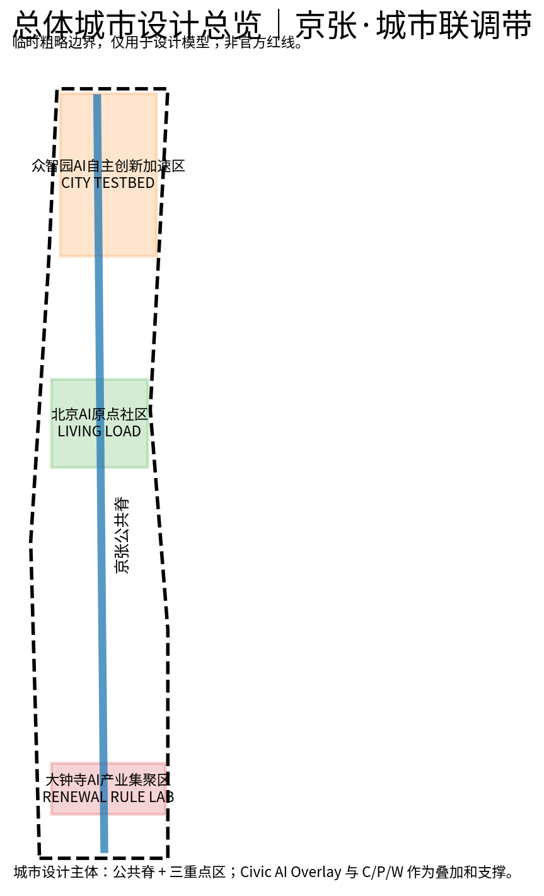
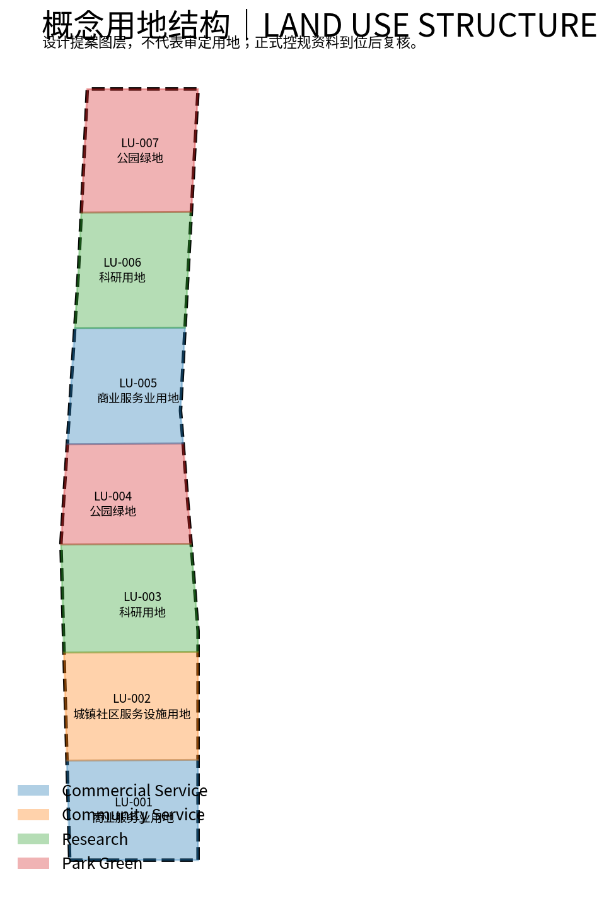
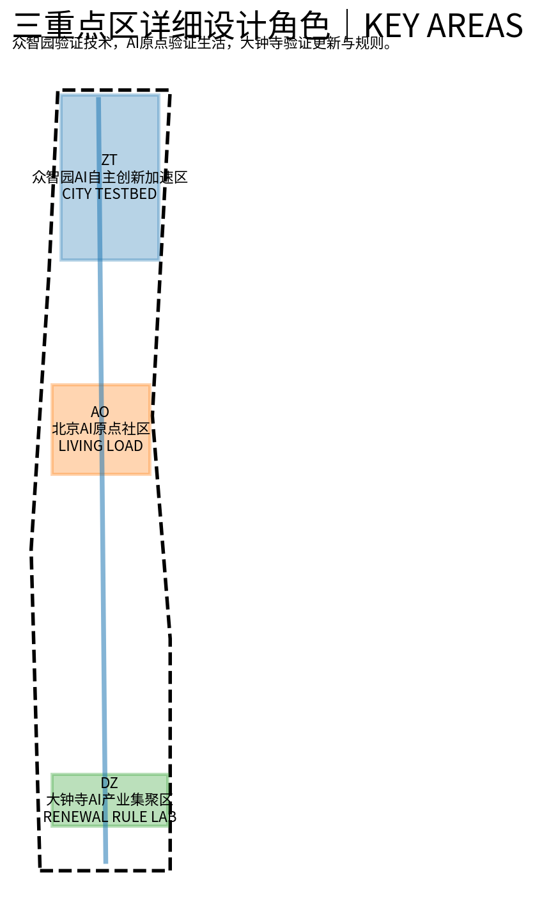
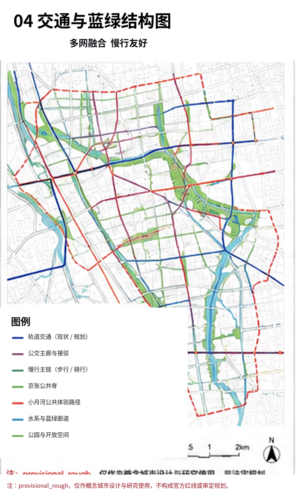
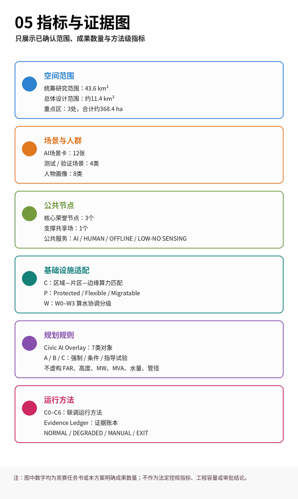

# 京张·城市联调带
## JING-ZHANG CITY COMMISSIONING BELT
### AI时代的城市规划与真实场景创新｜A CIVIC AI OVERLAY FOR THE AI-NATIVE CITY

**一句话方案：**

**京张·城市联调带不是一条展示AI的科技走廊，而是一套让AI从“技术可用”走向“公共可用”，再走向“规则可用”的城市机制。**

百年前，京张铁路通过测量、工程标准、试运行与复核建立可靠的物理连接；今天，当AI开始进入交通、市政、公共服务、社区生活和城市更新，城市需要建立另一套进入真实运行的规则。本方案不为AI另划一块“科技用地”，而是在既有城市规划之上提出 **Civic AI Overlay｜城市AI叠加管控层**：让AI所需的空间对象、资源接口、运行权限、责任主体、人工入口、数据与模型版本、复验条件和退出机制能够被规划表达。

三处重点区构成一条完整的城市能力转化链：

**众智园验证“能不能用” → AI原点验证“值不值得用、谁可以不用” → 大钟寺回答“成熟能力怎样进入规划与更新规则”。**

基础设施只提取AI进入真实城市最关键的 **Compute / Power / Water** 三项资源关系；C0–C6 + City Evidence Ledger 则作为运行验证与证据留痕方法。

**让AI不是被展示，而是被验证；不是接管城市，而是获得可审计的有限权限。**

> 本方案全部空间落位均为开放共创的概念建议。当前采用主办方仓库维护的 `provisional_rough` 临时边界，不代表官方红线；官方 polygon、控规、权属、文保和工程资料补齐后，所有面积、比例和地块级判断均须复核。 [source:BOUNDARY-SOURCE] [standard:PROJECT-OFFICIAL-ANNOUNCEMENT]

### 城市没有标准答案：人类智慧与硅基智慧共同服务真实生活

城市不是一道可以被一次性求出最优解的题目。它由不同的人、不同阶段的需求、长期形成的制度、基础设施和公共生活共同塑造，并在时间中持续被修正。

AI进入城市之后，真正重要的并不是城市能否部署更多模型、机器人或智能终端，而是城市能否在获得新能力的同时继续保护人的选择、公共利益和最终责任。

人类提供价值判断、经验、伦理、情感、责任和最终决策；硅基智慧能够提供规模化感知、复杂推演、实时协同和持续学习。二者共同服务的对象不是技术本身，而是人的生活和城市长期韧性。

因此，**共同目标不等于无限授权。**

Civic AI Overlay 是规划层，首先回答：

- AI作用于什么空间和对象；
- 调用哪些城市资源；
- 拥有多大权限；
- 谁对结果负责；
- 凭什么证据进入真实运行；
- 什么变化会触发复验、降级、回滚或退出。

C0–C6再回答这套能力怎样从证据基线、模拟和影子运行，逐步进入有限真实负载和人工监督运行。

**智慧可以增加，权力边界必须清楚；系统可以越来越聪明，城市必须始终保留人的选择权。**

每一项AI城市能力首先都只是一个待验证假设。证据不足就不扩大，风险不可控就回退，公共利益不成立就不做。我们不是让AI替城市决定未来，而是让城市获得一种持续理解自己、验证新能力、修正规则的能力。 [standard:PROJECT-AGENT-OPEN-CALL-TASKBOOK] [depth:risk_missing_data]

## 设计依据与资料清单

本方案正式任务依据来自主办方公告、仓库 `design_brief`、面向智能体任务书、公共资料登记表和临时边界。

方案方法同时吸收既有城市规划、市政基础设施、韧性城市、AIDC投产联调、AI赋能规划、城市更新和地下空间等专业研究经验，但不将内部客户底图、非公开指标或项目成果上传至公共仓库，仅迁移能够公开表达和普适复用的方法。 [source:OFFICIAL-ANNOUNCEMENT] [source:AGENT-TASKBOOK] [source:SOURCE-REGISTRY]

本方案形成四级清晰层级：

1. **城市设计主体**：京张公共脊 + 众智园 / AI原点社区 / 大钟寺 + 三区两翼；
2. **第一规划创新**：Civic AI Overlay；
3. **专业支撑**：Compute Matching / Compute–Power / Compute–Water；
4. **运行验证方法**：C0–C6 + City Evidence Ledger。

其中有三条核心专业判断。

第一，**AI进入城市以后，详细规划需要新增规划对象。**

边缘算力接口、能源柔性接口、机器人物流接口、感知边界、公共AI服务入口、运行权限、人工接管、版本信息和退出条件，不能长期停留在“智慧城市运营平台”的后台备注中，而应与空间对象、项目建设条件和责任主体建立关系。

第二，**中心城区的AI基础设施创新不是默认新增大型数据中心，而是进行资源适配。**

真正需要规划判断的是：什么任务必须本地执行、什么任务可以共享或迁移，什么时候需要电力和冷却条件，什么AI负载值得占用稀缺的中心城区能源、水和空间资源。因此，本方案不重新制造一套庞杂的网络概念，而把AI时代最具差异性的基础设施问题收敛为 Compute / Power / Water。

第三，**公共利益必须被空间化。**

AI带来的便利不能以强迫居民注册商业账号、持续接受感知或放弃人工服务为代价。凡涉及基础公共服务，AI入口之外原则上同时保留人工、离线和低/无感知路径。

[standard:PROJECT-AGENT-OPEN-CALL-TASKBOOK] [depth:existing_conditions_diagnosis]

## 六项必选任务覆盖索引｜agent.1–agent.6

六项必选任务不是六套互不相关的AI功能，而是同一城市系统的六个评审入口。机器可读对应关系见 `compliance_matrix.json`。

|必选任务|本方案的直接回应|主要证据位置|
|---|---|---|
|**agent.1 一带总体概念与功能统筹**|显式对齐“三大定位、五大功能、三区两翼”；以京张公共脊和三重点区为城市设计主体，以 Civic AI Overlay 为第一规划创新|三层范围、总体空间结构、9个GeoJSON、五张核心图|
|**agent.2 AI全栈自主创新与世界级生态**|建立 Research → Test → Limited Deployment → Daily Use → Evidence → Rule Update → Re-test 闭环；形成“技术可用—公共可用—规则可用”的转化链|国际机制案例、CITY TESTBED / LIVING LOAD / RENEWAL RULE LAB|
|**agent.3 AI+场景与智能活力城市**|12张正式场景卡不是12个App，而是对同一套证据、权限、人工和退出机制进行12类真实城市压力测试，其中4个为产业/规划验证场景|SC-01–SC-12、`metrics.json`|
|**agent.4 AI公共空间、新业态与朝圣地标**|京张遗址公园成为日常公共空间与开放创新公共脊，设置3个核心公共荣誉节点+1个支撑型共享场|公共空间章节、`public_space.geojson`|
|**agent.5 百年京张文化与AI新文化**|不复制铁路造型，而继承“先试运行、再进入真实运营”的工程文化，将其转化为AI时代的验证、证据、责任和公共理解|总叙事、First Run Yard、Open Evidence Hall|
|**agent.6 全球活动体系与长期运营**|通过 Commissioning Week、Open Urban AI Plugfest、Civic Audit Open Day、Rulebook Release 形成年度证据循环|长期运营、City Evidence Ledger|

以上任务共同服务同一个问题：

**当AI真正进入一座城市，它依据什么规划规则获得空间和权限，如何经过验证后运行，又如何在人类监督下持续复验、纠错和退出？**

[source:AGENT-TASKBOOK] [depth:professional_evidence_chain]

## 三层范围工作框架

**43.6km²统筹研究范围｜CITY SYSTEM。**

按照公告确定的城市级范围，研究AI科研、产业、人才、公共服务、算力能源与真实场景反馈如何形成区域闭环。该尺度关注功能协同、能力流和城市系统关系，使用公告文字面积和任务关系，不以临时 polygon 推定法定边界。 [source:OFFICIAL-ANNOUNCEMENT]

**约11.4km²总体设计范围｜CITY COMMISSIONING DISTRICT。**

以京张遗址公园及周边城市地区为主要空间载体，形成连续公共脊、东西向城市缝合、慢行与蓝绿系统、AI基础设施接口、市政韧性网络和存量更新项目体系。提交边界由 provisional geometry 复算约11.41km²，仅用于当前设计模型。 [data:geometry/site_boundary.geojson#SITE-001] [metric:site_area_sqm]

**三处重点区域约368.4ha｜CITY LABS。**

众智园、北京AI原点社区和大钟寺分别承担技术验证、真实日常负载和更新规则转化。三处 polygon 均为临时粗略范围，不代表道路红线或法定地块边界。 [data:geometry/key_areas.geojson#PROV-KEY-001] [metric:key_area_count]

## 统筹研究范围产业与未来城市研究

本方案先服从官方任务结构，再提出自己的规划创新。

三大定位对应：

- 百年京张文化带；
- 都市AI生活体验带；
- AI融合创新带。

五大功能对应：

- AI全栈自主创新体系；
- 世界级AI创新生态；
- AI+场景赋能新范式；
- 智能化AI活力城市；
- AI治理全球话语权。

空间上以京张遗址公园公共脊连接三个重点区，并通过中关村科技服务翼和小月河场景赋能翼，将科研、专业服务、社区、市政系统与真实生活场景接入同一个反馈系统。 [source:AGENT-TASKBOOK] [standard:PROJECT-AGENT-OPEN-CALL-TASKBOOK]

### 1. 城市设计主体：公共脊 + 三重点区 + 三区两翼

**京张公共脊首先是城市公共空间，其次才是AI界面。**

它延续京张铁路文化连续性，同时承担步行、自行车、无障碍、生态和东西向城市缝合。数字设施应小型化、分布式和可退出，与树荫、休息、导航、充电、应急和公共服务复合，而不是形成连续巨型科技屏幕或封闭式科技展示园区。 [standard:MOHURD-URBAN-DESIGN-MEASURES]

三处重点区也不是三个彼此孤立的“AI园区”，而是一条城市能力转化链：

### 众智园 CITY TESTBED｜技术可用

回答：

**一种AI能力能不能真正进入城市生产环境？**

重点验证设备、机器人、模型、网络和市政AI接口，在真实约束、故障、降级、数据变化和人工接管条件下能否稳定工作。

### 北京AI原点社区 LIVING LOAD｜公共可用

回答：

**这种能力是否真正改善生活？谁可以选择不用？**

住房、教育、健康、通勤、社区服务、老人、儿童、残障人士和普通居民构成真实日常负载。技术只有在不排斥非数字路径、不以强制数据授权换取基础公共服务的情况下，才具有公共价值。

### 大钟寺 RENEWAL RULE LAB｜规则可用

回答：

**经过验证并证明具有公共价值的能力，怎样进入存量城市的规划、更新项目和长期运营规则？**

大钟寺将真实测试与生活证据转化为空间接口、更新项目条件、公共利益底线和可动态维护的规则，但不预设TOD工程方案、法定开发强度、权利调整或拆迁结论。

因此，三个重点区共同形成：

**Technology Validity → Civic Validity → Planning Validity**

即：

**技术可用 → 公共可用 → 规则可用。**

[depth:overall_spatial_structure]

### 2. Civic AI Overlay｜AI时代的详规叠加管控层

**Civic AI Overlay 是本方案第一规划创新。**

传统详细规划主要回答：

**建什么、建多少、建在哪里。**

AI真正进入城市以后，规划还必须增加六类问题：

1. **Object｜对象**：什么AI能力、感知设备、边缘节点、自主系统或公共AI服务在这里运行？
2. **Spatial Scope｜空间**：作用范围、服务对象和影响边界在哪里？
3. **Resource Interface｜资源**：调用哪些道路、电力、水、算力、通信或公共空间资源？
4. **Permission & Responsibility｜权限与责任**：可以做什么、不能做什么、谁拥有最终权限并承担责任？
5. **Evidence & Version｜证据与版本**：依据什么数据、模型版本和测试证据进入运行？
6. **Re-test / Rollback / Exit｜复验与退出**：什么变化触发重新验证，失败以后如何降级、人工接管、回滚或退出？

因此，Civic AI Overlay：

**不是新的法定用地分类，不是智慧城市平台，也不是一套替代既有控规的AI规则。**

它是在既有法定规划之上增加：

**空间对象 + 资源接口 + 运行条件 + 权限责任 + 版本证据 + 退出条件。**

规划图继续决定城市的空间骨架，Civic AI Overlay回答AI能力怎样在这套骨架中安全进入、持续运行并随条件变化被重新验证。

每条规则采用统一机器可读结构：

`Rule ID → Spatial Scope → Object → Requirement/KPI → Source → Responsible Party → Permission → Commissioning Gate → Evidence → Version → Re-test Trigger → Rollback/Exit`

规则分为：

- **A Mandatory**：公共安全、隐私、公共利益、人工接管、审计和应急等不可绕过底线；
- **B Conditional**：满足明确前置条件或等效性能后才允许进入下一阶段；
- **C Guidance / Experimental**：试点、创新与可迭代建议。

AI可以提高规则检索、情景推演和一致性校核能力，但不能自动形成法定规划结论，也不能代替真实公众参与和有权主体审批。 [depth:professional_evidence_chain]

### 3. AI Infrastructure Support｜Compute–Power–Water Nexus

**AI时代基础设施创新，不等于在中心城区建设更大的数据中心。**

高密度建成区更关键的问题是：

**让正确的任务，在正确的时间调用正确的算力，并与当时真实可用的能源和冷却/水资源条件匹配。**

城市的有效服务能力不仅受物理基础设施存量制约，也取决于系统之间的协同效率和时空配置效率。算力可以改善预测、调度和资源配置，但不能代替道路、电网、水务、排水、消防和应急等物理系统。

因此，本方案只强化三项与AI负载直接相关的专业关系。

#### C｜Compute Matching

采用：

**区域算力 → 片区共享服务 → 边缘节点**

三级匹配。

规划问题不是简单回答“在哪里建设算力设施”，而是判断：

- 哪些任务具有真实本地低时延需求；
- 哪些任务涉及隐私或高可靠性，需要边缘执行；
- 哪些企业/城市模型推理可以共享；
- 哪些训练、批处理和可迁移任务应交由区域算力承担。

核心城区的土地、电力、水和散热资源应优先服务真正具有本地必要性的计算。

#### P｜Compute–Power Coordination

关注：

`AI workload × power condition × storage × flexible building load × time`

将负载划分为：

- **Protected｜保护型**：公共安全、关键城市服务等优先保障；
- **Flexible｜柔性型**：可根据能源和运行条件移峰；
- **Migratable｜可迁移型**：可以向区域算力或其他时间窗口转移。

当前不虚构MW、MVA、储能规模或设备容量。

#### W｜Compute–Water Coordination

采用 **W0–W3** 概念适配等级，从几乎不增加冷却用水的边缘微节点，到需要联合论证能源、冷却、用水、散热和余热利用的高密算力。

原则是：

**没有本地时延必要、却需要大量资源的任务，优先区域化。**

只有能源、用水、散热、空间和环境条件共同成立时，才讨论更高强度算力部署。

当前不虚构水量、管径、取水条件和工程线位。

通信、地下市政、交通物流继续作为城市基础工程条件，不重新包装成独立“六张网”原创体系。 [depth:municipal_new_infrastructure]

### 4. City Commissioning｜从“技术演示”到“有限真实运行”

City Commissioning 不是让城市长期处于实验状态。

它解决的是一个工程与治理问题：

**一个系统在演示环境中工作，不等于它已经可以承担真实城市负载。**

因此，众智园和整个京张城市联调体系不只验证算法指标，还关注接口兼容、真实负载、故障恢复、降级运行、数据变化、人工接管和长期维护。

C0–C6只作为运行方法：

**C0 Evidence Baseline｜证据基线**

→ **C1 Simulation｜模拟**

→ **C2 Rule Check｜规则校核**

→ **C3 Shadow / Dummy Load｜影子 / 假负载**

→ **C4 Limited Real Load｜有限真实负载**

→ **C5 Human-supervised Operation｜人工监督运行**

→ **C6 Recertification / Rollback / Exit｜复验 / 回滚 / 退出**

其中最重要的原则是：

**测试通过不是城市运行许可本身，而只是申请扩大真实运行权限的证据。**

模型、数据、设施、政策或使用环境发生重大变化时，应重新进入适当的验证阶段。

外部“双轨”思路在本方案中被收敛为：

**AI增强层与常规城市基底解耦。**

AI失效时，基础服务应按：

**NORMAL → DEGRADED → MANUAL → EXIT**

进行降级或退出。

真实切换时间、冗余等级和保障能力必须由工程设计和运营演练确定，不在概念阶段承诺“零影响”或“毫秒级无感切换”。

### 5. City Evidence Ledger｜城市证据账本

City Evidence Ledger 是Civic AI Overlay和C0–C6之间的证据接口。

每一个AI城市项目至少记录：

`Project ID / Spatial Scope / Operator / Responsible Human / Data Source / Model & Version / Risk Class / Permission / Commissioning Gate / Test Evidence / Failure Events / Human Intervention / Approval / Re-test Trigger / Rollback / Exit / Public Summary`

它的目的不是建立一个新的复杂平台，而是确保：

- 一个AI系统现在处于什么状态能够被说明；
- 为什么获得当前权限可以被追溯；
- 发生过哪些失败能够被记录；
- 谁进行过人工干预能够被确认；
- 模型或条件变化以后是否需要复验能够被判断；
- 公众能够区分“投稿、测试、试点、运行、退出”等不同事实状态。

### 6. 世界级AI创新生态：从企业集聚转向真实城市验证能力

世界级AI生态不能只用企业数量、办公面积或活动数量衡量。

京张真正稀缺的能力，是提供：

**Research → Test → Limited Deployment → Daily Use → Evidence → Rule Update → Re-test**

这一完整城市创新闭环。

- 众智园形成技术和接口证据；
- AI原点形成生活体验、公平性、无障碍和运营证据；
- 大钟寺将证据转化为更新和规划规则；
- 中关村科技服务翼提供科研、IP、人才、资本和专业服务；
- 小月河场景赋能翼提供生态、社区、市政和真实公共服务反馈。

七个国际案例不作为可复制的城市形态，而是拆解不同城市已经验证的机制零件：

- **EU CitCom.ai**：真实城市测试与实验设施；
- **Punggol Digital District**：城区数字底座与真实运行；
- **Helsinki / Forum Virium**：企业、居民和公共部门共同参与Living Lab；
- **Paris-Saclay DataIA**：科研—人才—创新连续体；
- **Toronto Vector Institute**：研究工程化和产业采用；
- **London Knowledge Quarter**：机构密度、公共文化与可步行创新环境；
- **监管沙盒机制**：有限范围、持续监测、真实证据和可暂停运行。

**京张组合机制，不复制形态。**

它以海淀科研与产业能力为起点，以真实城市作为验证环境，再把证据转化为可复用的城市规则。

[metric:ecosystem_case_count]

### 7. 品牌与文化：从铁路试运行到城市AI联调

主名称保持：

**京张·城市联调带｜JING-ZHANG CITY COMMISSIONING BELT**

百年铁路文化不是视觉装饰，也不需要用人字形铁路、火车剪影或“复古+赛博”的造型反复表达。

本方案继承的是更深层的工程文化：

**测量 → 建设 → 测试 → 复核 → 真实运营。**

百年前，京张铁路需要证明一套新的工程系统足以承担真实运输。

今天，AI创新带需要回答类似但更复杂的问题：

**一套新的智能能力怎样被城市证明、授权、监督和持续复验。**

因此品牌系统使用：

**Overlay / Interface / State / Evidence**

作为视觉和信息语法。

核心短句：

**PROVE BEFORE SCALE｜验证后再扩展**

治理原则：

**HUMAN OVERRIDE BY DESIGN｜人工接管是设计内建能力**

## 总体设计范围城市更新与控规深度城市设计

总体设计不把AI设施简单叠加在一张普通城市设计图上，而将：

**公共空间 + 存量更新 + Civic AI Overlay + C/P/W基础设施适配**

作为一个整体设计问题。

用地模型按照统一国土空间用地分类形成科研、公园绿地、商业服务和社区服务等概念功能梯度，仅用于表达功能关系和空间接口，不代表审定用地。 [data:geometry/land_use.geojson#LU-001] [standard:MNR-LAND-USE-CLASSIFICATION-GUIDE]

Civic AI Overlay继续采用A/B/C三级规则。

凡涉及：

- 开发强度；
- 建筑高度；
- 土地产权；
- 拆迁；
- 历史文化保护；
- 市政容量；
- 工程安全；

等法定或工程判断，资料不足时明确保持 `unknown / to verify`，不允许AI为了文本完整自行补数。 [depth:land_use_layout]

### 更新逻辑：从一次性蓝图走向“单元统筹—项目实施—动态维护”

存量地区不适合只通过一次性空间蓝图解决长期变化。

本方案采用：

**体检 → 协商 → 策划 → 行动 → 联调 → 复验**

的渐进更新逻辑。

现阶段建筑和地块只表达四类概念动作：

- **KEEP / 保留适应**
- **ADAPT / 改造开放**
- **TEMPORARY / 临时可逆**
- **TRIGGERED / 条件触发的新建或更大尺度更新**

在缺乏产权、结构安全、历史价值、现状建筑质量和法定指标调查的情况下，不指定具体拆除对象，也不将提高容积率作为默认经济平衡方式。 [standard:MOHURD-CONTROL-DETAILED-PLANNING] [depth:retain_renovate_demolish]

城市更新的规划创新不在于让AI“自动设计”，而在于提高：

- 证据组织；
- 多方案推演；
- 规则校核；
- 多主体诉求整理；
- 项目状态维护；
- 版本追踪。

AI不能自动决定产权、补偿、拆迁和法定开发指标。

### City Commissioning Pod｜模块化城市联调舱

作为空间原型，联调舱只在确有需要时复合：

- 边缘推理；
- 能源接口；
- 公共感知告知；
- 人工求助；
- 物理停用能力。

数量、间距、设备功率、储能规模和具体结构不在本阶段规定；正式工程条件到位后再选址与定型。

其意义在于提供：

**可插拔、可更新、可迁移、可停用**

的城市AI接口，而不是把概念原型伪装成施工图。

## 重点区域详细设计

### A. 众智园｜CITY TESTBED
#### 从 Demo 到 Production

众智园不是AI产品展示园，而是AI城市系统进入真实城市前的开放测试和验证环境。

它要回答：

**一个系统除了“能演示”，是否真的“能运行”？**

空间模块包括：

- 开放测试场；
- 机器人 / 自主系统测试路网；
- 边缘算力与通信节点；
- 能源接口；
- 模型安全与治理实验室；
- 开发者共享设施。

三类重点验证包括：

1. ICT / 算力 / 终端 / 接口互操作；
2. 机器人与自主物流物理测试；
3. 市政AI影子运行、故障和恢复。

验证应覆盖正常工况，也覆盖：

- 设备故障；
- 网络中断；
- 输入异常；
- 数据漂移；
- 资源不足；
- 人工接管；
- 降级和恢复。

**测试通过只形成证据，不自动等于城市运行许可。**

只有证据成熟以后，才讨论是否进入C4有限真实负载以及是否扩大运行空间和权限。 [data:geometry/key_areas.geojson#PROV-KEY-001]

外部“硬件中试”的思路在这里被转化为多环境、可复现、可熔断的验证条件，但本阶段不虚构高低温舱、固定测试环线尺寸或专业实验设施规模。

### B. 北京AI原点社区｜LIVING LOAD
#### 一座可以选择用AI，也可以不用AI的真实社区

AI原点社区不是追求“AI使用率最高”的社区。

它要回答：

**AI进入居民真实生活以后，是否真的产生公共价值；居民是否仍然拥有选择不用AI的权利。**

住房、教育、健康、养老、托育、社区服务、商业、通勤、无障碍和夜间生活首先作为正常城市生活成立，AI再作为增强能力进入。

基础公共服务原则上提供四条路径：

1. **AI｜智能入口**
2. **HUMAN｜人工入口**
3. **OFFLINE｜离线入口**
4. **LOW / NO SENSING｜低或无感知路径**

四条路径追求的是：

**基础公共服务结果等价，而不是界面完全一致。**

居民可以主动使用AI，也可以不用AI；可以联网，也可以离线；可以授权必要的数据，也可以选择不进入持续感知环境。

基础服务不得以：

- 注册商业AI账号；
- 强制持续感知；
- 同意非必要数据采集；

作为获得公共服务的前提。

“算法透明”在空间中转化为可见的公共解释界面：

- 感知什么；
- 为什么感知；
- 使用什么模型或规则版本；
- 谁负责；
- 如何转人工；
- 如何投诉或申诉；
- 如何退出。

真正的AI原生社区不是要求所有人进入同一种智能系统，而是在获得技术增益的同时仍然保留人的选择权。 [data:geometry/key_areas.geojson#PROV-KEY-002] [standard:BARRIER-FREE-ENVIRONMENT-LAW]

### C. 大钟寺｜RENEWAL RULE LAB
#### AI更新单元详规工作台

大钟寺是本方案最具规划专业含量的重点区。

它要回答：

**经过测试并证明具有公共价值的AI能力，怎样进入存量城市更新、项目条件和详细规划规则？**

大钟寺的创新不是让AI重新生成一张控规，而是探索存量地区如何从一次性指标分配逐步走向：

**单元统筹 → 项目实施 → 动态维护。**

工作流采用：

**现状体检与证据基线**

→ **问题 / 需求 / 意愿整理**

→ **多主体协商**

→ **片区—地块空间与经济校核**

→ **公共利益校核**

→ **A/B/C规则生成**

→ **更新项目清单**

→ **临时利用 / 可逆试点**

→ **分阶段实施**

→ **一张图维护**

→ **复验与版本更新**

输出形成三类成果。

**规则：**

- 公共利益底线；
- AI与基础设施接口要求；
- 可逆使用条件；
- 人工 / 离线服务要求；
- 权限和责任；
- 复验与退出条件。

**项目：**

- 公共空间补短板；
- 适应性再利用；
- 步行和站城联系改善；
- 临时创新空间；
- 公共服务；
- 站城复合和商业服务场景。

**状态：**

- 待核实；
- 可试点；
- 需专业审查；
- 需法定程序；
- 暂不实施。

AI可以辅助证据整理、规则查询、情景比选、片区—地块校核和版本维护。

但是：

**AI不能代替真实公众参与，不能自动决定土地权利、拆迁、补偿、容积率和法定规划结论。**

外部提出的高并发商业、机器人、低空和站城新业态可以作为场景进入规则实验，但不在本阶段直接承诺下沉广场、无人机巢、Robo-Shuttle等具体工程。 [data:geometry/key_areas.geojson#PROV-KEY-003] [depth:three_key_area_detailed_design]

## AI 创新生态、人才画像与 AI+ 场景

### 8类用户：公共利益测试集

8类用户不是人物画像装饰，而是城市AI系统的真实负载和失败判据。

如果一个系统只能服务年轻、熟悉数字工具的用户，却无法让老人、残障人士、普通居民、运维者和监管者获得可理解、可选择、可接管的服务，它就还没有通过真实城市测试。

|人物|最关心的城市任务|AI应做什么|不能接受的失败|
|---|---|---|---|
|AI科研/开发者|测试模型、终端、机器人与接口|提供可复现测试环境和证据|测试通过被误写成城市准入|
|创业团队/企业|低成本验证产品和寻找真实需求|提供接口、场地、合规路径和失败反馈|只有展示，没有可验证真实负载|
|居民与家庭|通勤、教育、健康、社区与休闲|降低办事和信息成本|基础服务被商业账号或强制授权绑架|
|老人/残障人士|无障碍、人工帮助和可靠服务|提供可解释导航、状态信息和人工转接|断网或模型失败后服务消失|
|学生/访客|学习、参观、参与创新活动|提供低门槛学习与公共解释|公共空间成为专业技术展厅|
|市政运维人员|安全、故障、维护和应急|辅助诊断、影子运行和调度建议|AI越权控制关键设施|
|产权人/开发主体|更新可行性、规则和投入|提供多方案推演与规则校核|AI自动决定拆建、权利或补偿|
|规划监管/公共决策人员|公共利益、程序、规则与责任|提供证据链、模拟和机器可读校核|黑箱结果替代专业判断和公众参与|

[metric:persona_count]

### 12张场景卡：对同一城市规则的12组压力测试

12张场景卡不是12套孤立App。

它们是在不同：

- 空间；
- 用户；
- 数据条件；
- 资源消耗；
- 风险等级；

之下，对 Civic AI Overlay 和同一套“证据—权限—人工—回滚”机制进行压力测试。

|ID|空间/类型|用户与任务|数据与隐私|人工复核/运营|风险与退出|
|---|---|---|---|---|---|
|SC-01|众智园·工业验证|AI基础设施互操作Plugfest|公开接口/测试数据，隔离生产数据|测试机构+厂商；人工批准|互操作失败即隔离，不进入C4|
|SC-02|众智园·工业验证|机器人与自主物流微枢纽|道路/设备状态，最小化人员识别|现场熔断+远程接管|行人冲突、故障即停运|
|SC-03|众智园/小月河·工业验证|AI市政控制沙盒|水/排水/能源运行数据分级授权|市政运营主体最终确认|先影子运行，越权即回滚|
|SC-04|大钟寺·规划验证|机器可读详规/规则引擎|公开规划与项目证据|规划人员审核|不得自动形成法定结论|
|SC-05|AI原点·公共服务|公共服务Agent站|用户主动输入、最小采集|人工窗口可转接|账号/模型失效仍保持人工服务|
|SC-06|原点+公共脊|全龄无障碍出行Agent|坡度、电梯、施工、积水状态|高风险路线人工确认|离线地图+人工帮助兜底|
|SC-07|小月河/沿线|内涝韧性Agent|实测/预测/模拟严格标识|封控决策由授权主体确认|模型不确定时降级为提示|
|SC-08|众智园+总体区|算力—电力—水资源适配与任务编排|任务等级、能源、冷却和资源约束|园区/能源/设施运营者联合复核|保护型优先，可迁移任务转区域算力|
|SC-09|京张公共脊|AI城市微节点|低敏公共信息|公共空间运营者|断网仍保持遮阴/休息/应急|
|SC-10|公共脊|活动/人群资源调度|聚合客流，不做人脸身份追踪|活动运营+应急人工确认|不进行无边界自动执法|
|SC-11|公共脊地标|开源贡献墙与公共AI审计节点|公开版本、来源和测试状态|项目运营组织|明确投稿/测试/入选/落地状态|
|SC-12|大钟寺|更新议事厅+片区地块优化|公开规则+经授权项目参数|多主体协商，人类最终决策|不模拟公众替代公众，不自动拆迁|

SC-01/02/03/04构成4个产业/规划验证场景，满足“不少于3个验证场景”的任务要求。 [metric:scenario_card_count] [metric:test_validation_scenario_count]

AI+医疗、教育、法律、生活、商业和交通作为垂直服务子卡：

- 医疗只做健康导航和就医协同，不自动诊断；
- 教育场景保留教师审核；
- 法律与规划Agent只解释公开规则和办事路径；
- 商业服务不以黑箱评分决定商户准入；
- 交通与无障碍、积水等真实状态共享证据层。

所有AI+应用共享同一套：

**证据 → 风险 → 权限 → 人工 → 回滚**

底座，而不是为每一个场景重复建设孤立系统。 [standard:GENERATIVE-AI-INTERIM-MEASURES]

## 用地、建筑规模与拆改留方案

用地模型覆盖当前提交边界，采用科研用地、公园绿地、商业服务业、社区服务设施等统一分类，服务：

**研究 → 验证 → 日常生活 → 更新转化**

的功能链。

绿地和公共空间指标均从当前提交几何复算；建筑基底仅作为重点区概念更新单元，用于表达：

**保留适应 / 改造开放 / 临时可逆 / 条件触发**

等动作，不代表完整现状调查。 [metric:green_ratio] [metric:building_footprint_area_sqm]

由于公开资料缺少经批准的FAR、建筑高度、退线、密度、权属和完整建筑调查：

`floor_area_ratio`

和

`building_height_control_m`

继续保持 `unknown`。

正式资料补齐后，应先替换约束和现状数据，再统一复算面积、比例、体量和项目边界，不把当前概念设计量包装成审定指标。 [standard:MOHURD-CONTROL-DETAILED-PLANNING] [depth:development_intensity_controls]

## 交通、轨道、市政与公共服务设施

### Commissioning Right-of-Way｜分级分权的调测路权

AI时代的路权创新不是让机器人、自动驾驶或无人系统取得高于人的公共空间权利，而是在普通城市交通基础上，为新型设备建立明确的测试边界和条件性权限。

空间原则：

- **公共慢行主脊优先**：步行、自行车、无障碍和日常公共生活拥有最高公共性；
- **低速机器人 / 配送测试属于条件性路权**：只在明确地理围栏、时段、速度、责任主体和人工接管条件下进入限定路段；
- **机动车与应急系统保持常规城市交通逻辑**：AI测试不能削弱消防、救护、公交和正常通勤；
- **低空与地下接口只作 CONDITION-BASED 预留**：无人机物流、地下微管廊或专用能源/散热通道，需在空域、安全、文保、市政容量和工程可行性明确后再深化。

三处概念东西向缝合点只表达跨越城市断点的慢行和公共空间连接需求，不预设必须建设天桥；最终采用平交、桥、隧或其他方式，需依据正式道路、轨道、权属和工程条件确定。 [data:geometry/roads.geojson#ROAD-X01] [depth:traffic_rail_slow_parking]

### C/P/W基础设施适配

**Compute：**

区域算力承担训练和可迁移批处理；片区共享服务承担城市模型、科研和企业推理；边缘节点服务真正具有低时延、隐私敏感或高可靠需求的任务。

**Power：**

按 Protected / Flexible / Migratable 分类组织资源协调。优先保护公共安全与关键城市服务，柔性负载移峰，可迁移计算转移。不虚构供电容量。

**Water：**

W0–W3作为冷却与用水规划适配等级。高密度算力只有在能源、冷却、用水、散热和余热条件共同成立时才可进入。不存在本地必要性的高耗资源计算优先区域化。

**通信与地下市政：**

采用多路径、关键节点冗余、可维护和故障隔离原则。

AI可以提高预测和调度能力，但：

**预测能力不等于自动控制权。**

[depth:municipal_new_infrastructure]

### 公共利益空间标准：四条等价路径

凡承载基础公共服务的AI节点，原则上同时设计：

1. **AI入口**：允许主动使用智能服务；
2. **人工入口**：现场窗口、值守或人工转接可直接获得；
3. **离线入口**：无账号、断网或模型不可用仍能完成基础任务；
4. **低/无感知路径**：不愿进入持续感知环境的人仍可正常通行和使用公共空间。

验收不看界面是否完全一致，而看基本任务结果是否可达。

例如：

- 轮椅用户能否完成同样的办事任务；
- 老人能否不使用商业账号获得基础服务；
- 网络中断后是否仍保留核心功能；
- 系统是否明确显示人工责任主体；
- 是否存在投诉、申诉和退出入口。

[standard:BARRIER-FREE-ENVIRONMENT-LAW] [depth:blue_green_public_space]

## 蓝绿空间、公共空间与城市风貌

京张遗址公园首先是一条：

**开放、日常、可步行的城市公共脊。**

而不是科技展廊。

城市风貌强调：

- 真实街道；
- 树荫；
- 休憩；
- 儿童和全龄活动；
- 铁路遗产连续叙事；
- 小尺度数字界面。

建筑体量采用“沿公共脊开放、重点节点形成识别、重点区内部适应真实功能”的原则，不在缺少控规和文保资料时给出高度数值。 [standard:MOHURD-URBAN-DESIGN-MEASURES] [depth:blue_green_public_space]

### Digital Quiet / Low-Sensing Zones｜数字宁静与低感知空间

在居住、儿童、无障碍和生态敏感场景中，优先采用：

- 最小必要感知；
- 明确告知；
- 非识别技术；
- 本地处理；
- 可退出机制。

未经授权的人脸识别、持续身份追踪或深度扫描，不作为进入公共空间的默认条件。

本阶段不把低感知区域画成法定红线，其具体范围由正式用途、隐私影响、技术必要性和运营责任共同确定。

### 公共节点：3个核心荣誉节点 + 1个支撑共享场

**1. First Run Yard｜首发试运行场**

把铁路工程“测试—复核—真实运营”的文化转换为AI城市联调的公共起点。

**2. Open Evidence Hall｜开放证据厅**

公开规则、来源、版本、测试证据、失败记录和开源贡献。

**3. Civic Override Beacon｜公共接管灯塔**

让“AI有限权限、人工最终责任、可降级、可退出”成为公众可理解的空间符号。

**4. Commissioning Commons｜联调共享场**

作为开发者、居民、企业、运维者和公共部门共同测试、交流和反馈的支撑型共享空间，不列入三个核心公共荣誉节点。

机器可读层以 `PUBLIC-LM-01`、`PUBLIC-LM-02`、`PUBLIC-LM-03` 表达三个核心节点的概念代表点；这些点位均落在当前 `provisional_rough` 重点区或公共脊模型内，仅用于表达节点关系，不代表官方地块、红线或精确建设位置。 [data:geometry/public_space.geojson#PUBLIC-LM-01] [data:geometry/public_space.geojson#PUBLIC-LM-02] [data:geometry/public_space.geojson#PUBLIC-LM-03]

以 `PUBLIC-LM-004` 表达支撑型共享场的面状范围，同样不代表官方地块、红线或精确建设位置。 [data:geometry/public_space.geojson#PUBLIC-LM-004]

[metric:ai_landmark_count]

## 更新项目清单、实施政策与分期计划

实施不采用虚假的固定年份承诺，而采用：

**NOW / NEXT / CONDITION-BASED**

### NOW｜现在即可推进

低前置条件、可逆、公共价值明确的事项：

- Civic AI规则库；
- City Evidence Ledger；
- 公开证据网页；
- 开发者和公众活动；
- 公共空间微节点；
- 影子运行场景；
- 可逆临时创新空间；
- 无障碍服务；
- 低/无感知路径。

### NEXT｜证据成熟后扩展

在测试、运营责任和工程条件进一步明确后推进：

- 众智园测试环境；
- 边缘推理和能源接口；
- 机器人与物流微枢纽；
- AI原点社区公共服务网络；
- 大钟寺更新规则试点；
- 规划议事厅；
- 站城复合服务场景。

### CONDITION-BASED｜条件触发

只有正式规划、工程论证、部门审批、风险评估和联调证据共同满足条件后，才考虑：

- 扩大真实控制型AI运行；
- 低空物流；
- 大规模地下系统改造；
- 高强度算力基础设施。

[data:geometry/phasing.geojson#PHASE-001] [metric:phasing_stage_count]

### 长期运营：年度证据循环

运营不是持续做展示活动，而是持续产生能够反馈到规则和城市设计中的证据。

**JZ Commissioning Week**

公开年度测试议题、演示、阶段成果和失败案例。

**Open Urban AI Plugfest**

形成设备、软件、模型和接口互操作报告及问题清单。

**Civic Audit Open Day**

进行人工接管、公众反馈、失效测试和风险复盘。

**Rulebook Release**

公开年度规则版本、变更说明、复验结果和退出记录。

运营与经济机制采用：

**公共基础投入 + 开放测试 / 专业服务 + 场景运营 + 空间运营**

的多元组合思路。

重点是把测试、证据、维护和公共服务成本显性化，而不在本阶段预设特许收费标准、地产溢价、收益率或财政承诺。

以上均为参赛方案建议，不代表政府已经确定相关活动、组织架构和收费机制。 [source:AGENT-TASKBOOK]

## 指标体系、面积复算与合规矩阵

当前能够由任务书、提交几何或结构化清单复核的核心指标包括：

- 临时总体设计边界约11.41km²；
- 设计模型绿地比例约17.6%；
- 公共空间比例约6.7%；
- 三处重点区域；
- 12张场景卡；
- 4个产业/规划验证场景；
- 8类用户画像；
- 3个核心公共荣誉节点 + 1个支撑型共享场。

绿地、公共空间和建筑基底均为：

**当前设计模型输出。**

不作为现状统计或政府承诺。 [metric:site_area_sqm] [metric:green_ratio] [metric:public_space_ratio]

本方案所有数字遵循一个原则：

**能复核的才写，不能复核的保持未知。**

任何依赖：

- 正式控规；
- 人口数据；
- 权属；
- 道路红线；
- 文保控制线；
- 市政容量；
- 工程勘察；

的指标保持待确认。

正式资料到位后统一触发：

**数据替换 → 几何复核 → 指标复算 → 规则复验。**

合规覆盖写入 `compliance_matrix.json`，专业规范响应写入 `standard_matrix.json`，设计深度证据写入 `design_depth_matrix.json`。 [depth:metrics_recalculation]

## 风险、版权与合规说明

1. **`provisional_rough` 不是 official redline。**
   官方 polygon、控规、权属、文保和工程资料到位后，面积、比例、项目和接口必须重新复核。

2. **不虚构工程与法定参数。**
   FAR、高度、MW、MVA、水量、管径、低空高度、机器人道路宽度、联调舱间距、测试天数、投资额、收益率等，不得为了“方案完整”由AI补造。

3. **Dual-Track Fail-Safe｜双轨失效安全。**
   AI增强层必须能够被暂停、隔离、降级或退出，基础公共服务保留人工、离线或普通城市运行路径。真实切换时间和冗余能力需由工程验证确定。

4. **AI模拟公众不等于公众参与。**
   涉及公共权利、空间分配、土地、拆迁、价格和法定规划的决定，仍由真实公众参与、专业审查和有权主体作出。

5. **Digital Quiet / Low-Sensing。**
   公共空间不以持续身份识别为默认条件，数据最小化、用途限制、人工申诉和低/无感知路径进入设计要求。

6. **Compute–Power–Water 是规划适配框架，不是工程容量结论。**
   当前缺乏正式容量和工程条件，不据此推定大型数据中心、供电扩容或新增取用水工程可实施。

7. **测试证据不自动产生城市运行权。**
   众智园或任何测试场景通过验证，只说明获得了相应证据，不代表自动进入更高等级真实城市控制。

8. **版权与来源边界。**
   本次图件、GeoJSON、HTML和PDF为本投稿生成或整理。内部客户底图、非公开指标、未清权图片和受限工程资料不进入公共仓库。视觉成果含AI辅助生成与人工复核，技术文字、指标和空间边界以结构化数据和最终人工审查为准。

9. **本成果属于开放共创概念建议。**
   可供后续专业团队深化，不构成审批、工程可行性、投资或实施承诺。

[standard:GENERATIVE-AI-INTERIM-MEASURES] [depth:risk_missing_data]

## 结语｜从“铁路试运行”到“城市AI联调”

百年前，京张铁路回答的是：

**一套新的工程系统怎样被证明可靠，并进入真实运营。**

今天，京张AI创新带需要回答：

**一项AI能力怎样被城市证明、授权、监督、修正和退出。**

众智园把技术变成经过验证的能力；

AI原点社区检验这种能力是否真正改善人的生活，并保留人的选择权；

大钟寺再把成熟证据转化为可以被规划、项目和治理持续使用的城市规则。

Civic AI Overlay让这些规则拥有空间对象、资源接口、权限、责任、版本和退出条件；

Compute–Power–Water让每一种AI能力接受真实城市资源约束；

C0–C6与City Evidence Ledger则确保城市只在证据成熟以后逐步扩大运行范围。

**京张真正值得成为AI创新带的地方，不是这里展示最多AI。**

而是这里能够证明：

**只有经过验证、尊重人的选择、接受公共规则约束的AI，才值得被城市放大。**

**PROVE BEFORE SCALE｜验证后再扩展。**

## 参考资料

本方案机器可读来源清单见 `sources.json`。

正式任务与范围以主办方公告、仓库 `brief/site-package/`、`agent_taskbook.json`、`data/source_registry.json` 和主办方维护的 provisional geometry 为主。

公告和任务书用于确定：

- 三层范围；
- 三大定位；
- 五大功能；
- 三区两翼；
- agent.1–agent.6。

临时几何仅用于开放征集阶段的：

- 概念设计；
- 面积复算；
- 空间一致性检查；

不作为 official redline、法定控规或审批依据。

专业标准通过 `standard_matrix.json` 映射至具体章节、图层、指标、来源和假设；设计深度通过 `design_depth_matrix.json` 逐项说明完成内容及 `completeness_limited_by`。

国际案例仅作机制级比较，不推定海淀已经建立合作、采用同类政策或复制对应城市形态。

所有缺失的FAR、高度、权属、文保、市政容量、低空管理、道路红线和工程参数继续保持 `unknown` 或条件性判断，并在权威资料发布后触发统一复核与复算。 [source:SOURCE-REGISTRY] [standard:PROJECT-OFFICIAL-ANNOUNCEMENT] [depth:risk_missing_data]
